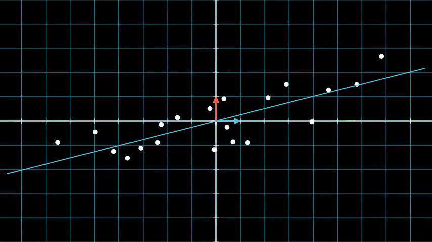
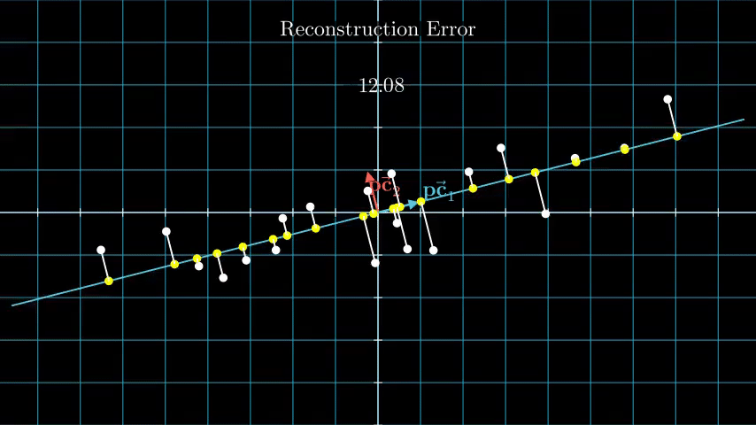
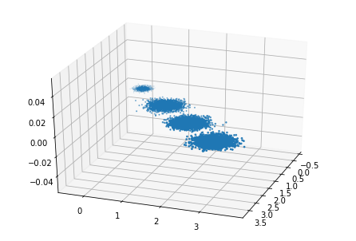
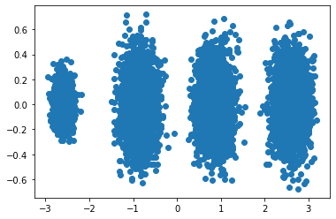
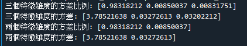

# Principal-Component-Analysis-PCA
使用python3.8練習PCA
## Principal-Component-Analysis介紹
* 特性:

  中文為主成分分析，為一種降維(Dimension reduction)技術，可保留物體一定量的特徵

* 概念:

  將原始數據拆解成更具代表性的主成分，並以其作為新的基準，重新描述數據，通常用於高維數據集的探索與可視化，還可以用於數據壓縮、數據預處理

  
  
  透過投影矩陣P1，也就是一個線性轉換來降維，這樣的降維方法被稱作線性降維。線性降維中最著名的方法也就是PCA

  
  
  數據白點對應投影點黃點，而我們會計算這兩點間每組數據的長度和，而當長度和越小時，就會得到最具相關性的降維投影點

## 程式碼: 

  * 輸入:
    > X, y = make_blobs(n_samples=10000, n_features=3, centers=[[3, 3, 3], [0, 0, 0], [1, 1, 1], [2, 2, 2]], cluster_std=[0.2, 0.1, 0.2, 0.2], random_state=9) 
    如下圖
    
    
  * PCA model:
    > from sklearn.decomposition import PCA
    > pca = PCA(n_components=3) 
    > pca.fit(X) 
    
* 成果: 
  * 二維圖:
  
  
  
  * 數值比較:
  
  
  
